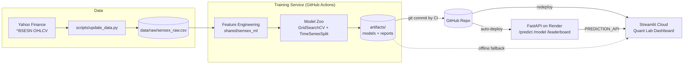

<div align="center">

# 📈 Sensex Quant Lab

**A production-grade quantitative forecasting platform for the BSE Sensex — predicting the next session's _Open_ and _Close_.**

[](https://www.python.org/)
[](https://fastapi.tiangolo.com/)
[](https://streamlit.io/)
[](https://scikit-learn.org/)
[](https://render.com/)
[](https://github.com/Harshithpatali/Sensex_Quant_Lab/actions)

[Overview](#-overview) · [Architecture](#-architecture) · [Quick Start](#-quick-start-local) · [API](#-api-reference) · [Deploy](#-deployment) · [Methodology](#-methodology) · [Disclaimer](#-disclaimer)

</div>

---

## 📑 Table of Contents

1. [Overview](#-overview)
2. [Key Features](#-key-features)
3. [Architecture](#-architecture)
4. [Tech Stack](#-tech-stack)
5. [Project Structure](#-project-structure)
6. [Quick Start (Local)](#-quick-start-local)
7. [Methodology](#-methodology)
8. [Training Service](#-training-service)
9. [API Reference](#-api-reference)
10. [Dashboard](#-dashboard)
11. [Deployment](#-deployment)
12. [Daily Automation (CI/CD)](#-daily-automation-cicd)
13. [Configuration](#-configuration)
14. [Metrics Philosophy & Expected Performance](#-metrics-philosophy--expected-performance)
15. [Troubleshooting](#-troubleshooting)
16. [Limitations](#-limitations)
17. [Roadmap](#-roadmap)
18. [Contributing](#-contributing)
19. [Disclaimer](#-disclaimer)

---

## 🔭 Overview

**Sensex Quant Lab** is an end-to-end machine-learning system that forecasts two targets for the **BSE Sensex** (`^BSESN`) for the **next trading session**:

| Target | Meaning |
|--------|---------|
| **Next-session Open** | Predicted opening level / return of the following trading day |
| **Next-session Close** | Predicted closing level / return of the following trading day |

The project is built as three decoupled services so each piece can be developed, deployed, and scaled independently:

- **Training service** – builds features, searches a *model zoo* with `GridSearchCV` + `TimeSeriesSplit`, and writes production artifacts.
- **API service** – a lightweight **FastAPI** app that loads the latest artifacts and serves predictions.
- **Dashboard** – a **Streamlit** "Quant Lab" UI with 3D visuals, market-regime views, and a model leaderboard.

A scheduled **GitHub Actions** workflow retrains the models every weekday after market close and commits fresh artifacts back to the repo, so the deployed apps always serve up-to-date models.

> ⚠️ This is a **statistical research tool**, not a trading signal. See the [Disclaimer](#-disclaimer).

---

## ✨ Key Features

- 🎯 **Dual-target forecasting** – separate models for next-session Open and Close.
- 🧪 **Model zoo with automated search** – multiple estimator families compared under identical, leakage-safe cross-validation.
- ⏱️ **Time-series-aware validation** – `TimeSeriesSplit` and chronological holdouts only; no random shuffling.
- 🏁 **Leaderboard** – every candidate model ranked by MAE and directional accuracy.
- 🌐 **Regime analysis** – market-regime views to understand *when* the models work and when they don't.
- 🧊 **3D visualisations** – interactive 3D plots in the dashboard.
- 🔌 **Clean REST API** – `/predict`, `/model`, `/leaderboard` endpoints.
- 🤖 **Fully automated retraining** – daily CI pipeline (Mon–Fri, 16:15 IST) plus a manual full-search workflow.
- 📦 **Reproducible artifacts** – trained pipelines serialised with `joblib` and versioned in Git.
- 🖥️ **Works offline** – the dashboard can read `artifacts/` locally without the API.
- ⚙️ **Three training profiles** – `smoke`, `daily`, `full` to trade speed for search depth.

---

## 🏗 Architecture



**Data flow in one sentence:** Yahoo data → raw CSV → features → model search → `joblib` artifacts committed to Git → API and dashboard load the newest artifacts on their next deploy/restart.

**Design principles**

1. **Shared core library** (`shared/sensex_ml`) is the single source of truth for config, data loading, features, and the model zoo — used identically by training, API, and dashboard so there is no train/serve skew.
2. **Artifacts as the contract** between services. Training writes them; API and dashboard only read them.
3. **Graceful degradation** – the dashboard works with or without the API.

---

## 🧰 Tech Stack

| Layer | Technology | Host |
|-------|------------|------|
| **Frontend** | Streamlit (3D visuals, regimes, leaderboard) | Streamlit Community Cloud |
| **Backend API** | FastAPI + Uvicorn (`/predict`, `/model`, `/leaderboard`) | Render |
| **Training** | Model zoo + `GridSearchCV` + `TimeSeriesSplit` | GitHub Actions (daily) |
| **Artifacts** | `joblib` models + reports | Git repo (committed by CI) |
| **Data source** | Yahoo Finance (`^BSESN`) | — |
| **Language** | Python 3.10+ | — |

---

## 🗂 Project Structure

```
Sensex_Quant_Lab/
├── services/
│   ├── api_service/
│   │   └── app.py                  # FastAPI application
│   ├── dashboard/
│   │   └── app.py                  # Streamlit Quant Lab (3D, regimes, leaderboard)
│   └── training_service/
│       ├── main.py                 # Training CLI entry point
│       └── ...                     # Training pipeline modules
├── shared/
│   └── sensex_ml/                  # Shared library
│       ├── config                  #   paths, profiles, constants
│       ├── data                    #   loading / cleaning OHLCV
│       ├── features                #   feature engineering
│       └── model_zoo               #   estimators + hyper-parameter grids
├── artifacts/
│   ├── models/                     # Serialised production models (.joblib)
│   └── reports/                    # Metrics, leaderboard, diagnostics
├── data/
│   └── raw/sensex_raw.csv          # Historical Sensex OHLCV
├── scripts/
│   └── update_data.py              # Pull latest data from Yahoo Finance
├── .github/
│   └── workflows/                  # daily_training.yml + full model search
├── render.yaml                     # Render blueprint
└── requirements.txt
```

> If your local folder is named `sensex_quant_prod/`, that is simply the repo root — all paths above are relative to it.

---

## 🚀 Quick Start (Local)

### Prerequisites

- Python **3.10+**
- `git`
- ~2 GB free RAM for `daily` profile (more for `full`)

### 1. Clone

```bash
git clone https://github.com/Harshithpatali/Sensex_Quant_Lab.git
cd Sensex_Quant_Lab
```

### 2. Create a virtual environment and install dependencies

**Windows (PowerShell)**

```powershell
python -m venv .venv
.\.venv\Scripts\Activate.ps1
pip install -r requirements.txt

$env:PYTHONPATH = "$PWD\shared"
$env:N_JOBS = "2"
```

**macOS / Linux**

```bash
python3 -m venv .venv
source .venv/bin/activate
pip install -r requirements.txt

export PYTHONPATH="$PWD/shared"
export N_JOBS=2
```

### 3. Train models

```bash
# smoke = fast sanity check, daily = practical, full = research-grade search
python services/training_service/main.py --mode smoke --splits 3
python services/training_service/main.py --mode daily --splits 3
```

### 4. Start the API

```bash
uvicorn services.api_service.app:app --host 0.0.0.0 --port 8000
```

Interactive docs are then available at **http://localhost:8000/docs**.

### 5. Start the dashboard (in a second terminal)

```bash
streamlit run services/dashboard/app.py
```

> The dashboard works **without** the API by reading `artifacts/` locally. Set `PREDICTION_API` to point it at a remote API (e.g. your Render URL).

---

## 🧠 Methodology

### Problem framing

For each trading day *t*, using information available **at or before the close of day *t***, predict:

- the **Open** of day *t + 1*, and
- the **Close** of day *t + 1*.

Because raw index levels are non-stationary, models are trained on **returns** and converted back to price levels for display.

### Data

- Historical daily OHLCV for the BSE Sensex from Yahoo Finance (`^BSESN`), stored at `data/raw/sensex_raw.csv`.
- Refreshed by `scripts/update_data.py`, which is also called by the daily CI job.

### Feature engineering

Features live in `shared/sensex_ml/features` and are computed strictly from past data. Typical families used in this kind of system include:

| Family | Examples |
|--------|----------|
| Lagged returns | 1/2/3/5/10-day close-to-close, overnight gap, intraday range |
| Trend | SMA/EMA ratios, price-vs-moving-average distance |
| Momentum | RSI, MACD, rate-of-change |
| Volatility | Rolling std, ATR, high–low range, realised volatility |
| Calendar | Day-of-week, month effects |
| Regime | Volatility / trend regime indicators |

<!-- TODO: replace the table above with the exact feature list implemented in shared/sensex_ml/features -->

### Model zoo

The **model zoo** (`shared/sensex_ml/model_zoo`) defines a set of candidate estimators and their hyper-parameter grids. Every candidate is:

1. wrapped in a preprocessing `Pipeline` (e.g. scaling where required),
2. tuned with `GridSearchCV`,
3. validated with `TimeSeriesSplit` (expanding window — training data always precedes validation data),
4. scored on a final **chronological holdout** that no model saw during tuning,
5. ranked on the **leaderboard**.

<!-- TODO: list the exact estimators in your zoo (e.g. Ridge/Lasso/ElasticNet, RandomForest, GradientBoosting, XGBoost/LightGBM, SVR, ...) -->

### Validation protocol

```
|------------- train -------------|-- val --|
|----------------- train ------------------|-- val --|
|---------------------- train ----------------------|-- val --|
                                                       |== holdout ==|
```

- **No shuffling, no random K-Fold** — that would leak future information.
- Scalers and any fitted transforms are fit **inside** each fold via the pipeline.
- The final holdout is the most recent chronological block.

### Training profiles

| Profile | Purpose | Search depth | Typical use |
|---------|---------|--------------|-------------|
| `smoke` | Verify the pipeline runs end-to-end | Minimal grids | Local dev, PR checks |
| `daily` | Practical everyday retrain | Moderate grids | Scheduled CI (Mon–Fri) |
| `full`  | Exhaustive research search | Large grids | Manual "Full Model Search" workflow |

---

## 🏋️ Training Service

```bash
python services/training_service/main.py --mode <smoke|daily|full> --splits <N>
```

| Flag | Description | Example |
|------|-------------|---------|
| `--mode` | Training profile (`smoke`, `daily`, `full`) | `--mode daily` |
| `--splits` | Number of `TimeSeriesSplit` folds | `--splits 3` |

**Environment variables**

| Variable | Description | Default |
|----------|-------------|---------|
| `PYTHONPATH` | Must include `shared/` so `sensex_ml` is importable | — |
| `N_JOBS` | Parallel workers for grid search | `2` recommended locally |

**Outputs**

```
artifacts/
├── models/     # best model per target (Open, Close) as .joblib
└── reports/    # leaderboard, metrics, diagnostics consumed by API + dashboard
```

---

## 🔌 API Reference

FastAPI service at `services/api_service/app.py`. Interactive OpenAPI docs are served at `/docs` (Swagger) and `/redoc`.

| Method | Endpoint | Description |
|--------|----------|-------------|
| `GET` | `/predict` | Next-session **Open** and **Close** forecast from the latest data |
| `GET` | `/model` | Metadata about the currently deployed models (type, params, training date, metrics) |
| `GET` | `/leaderboard` | Ranked results of all evaluated candidate models |

> 🔎 The response bodies below are **illustrative**. Check `/docs` on your running instance for the exact schema.

**Example**

```bash
curl https://YOUR-RENDER-URL/predict
```

```json
{
  "as_of": "2026-09-21",
  "target_session": "2026-09-22",
  "predicted_open": 0.0,
  "predicted_close": 0.0,
  "model": { "open": "…", "close": "…" }
}
```

```bash
curl https://YOUR-RENDER-URL/leaderboard
curl https://YOUR-RENDER-URL/model
```

> 💤 On Render's free tier the service sleeps after inactivity, so the **first request can take ~30–60 s** while it cold-starts.

---

## 🖥 Dashboard

The Streamlit **Quant Lab** (`services/dashboard/app.py`) provides:

- **Forecast panel** – next-session Open/Close predictions.
- **3D visuals** – interactive 3D exploration of the market/feature space.
- **Regime analysis** – performance and behaviour across different market regimes.
- **Leaderboard** – model comparison by MAE and directional accuracy.
- **Model details** – which estimator and hyper-parameters are in production.

**Data source priority**

1. If `PREDICTION_API` is set → call the remote API.
2. Otherwise → read `artifacts/` from the local repo checkout.

---

## ☁️ Deployment

### 1. Push to GitHub

```bash
git init
git add .
git commit -m "Sensex Quant Lab v3"
git branch -M main
git remote add origin https://github.com/Harshithpatali/Sensex_Quant_Lab.git
git push -u origin main
```

### 2. Backend on Render

1. Go to [render.com](https://render.com) → **New → Blueprint** → connect your repo (uses `render.yaml`)
   **or** **New → Web Service** with the repo root as the root directory.
2. **Build command:** `pip install -r requirements.txt`
3. **Start command:** `uvicorn services.api_service.app:app --host 0.0.0.0 --port $PORT`
4. **Environment:** `PYTHONPATH=shared`
5. Copy the public URL, e.g. `https://sensex-prediction-api.onrender.com`

Render auto-deploys on every new commit to `main`, including the CI's daily artifact commit.

### 3. Frontend on Streamlit Community Cloud

1. Go to [share.streamlit.io](https://share.streamlit.io) → **New app**.
2. Select the repo and branch `main`.
3. **Main file path:** `services/dashboard/app.py`
4. Under **Advanced settings → Secrets**, add:

```toml
PREDICTION_API = "https://YOUR-RENDER-URL"
```

(Alternatively set `PREDICTION_API=https://...` as an environment variable.)

---

## 🤖 Daily Automation (CI/CD)

Workflows live in `.github/workflows/`.

### `daily_training.yml` — Mon–Fri, 16:15 IST

Runs after the Indian market close (15:30 IST):

1. *(Optional)* refresh raw data from Yahoo Finance via `scripts/update_data.py`
2. Train using the `daily` profile
3. Commit updated `artifacts/` and `data/` back to `main`
4. Render auto-deploys; Streamlit picks up the new commit on next restart/redeploy

### Full Model Search — manual

**GitHub → Actions → Full Model Search → Run workflow** runs the exhaustive `full` profile for research-grade model selection.

> Note: GitHub cron uses **UTC**. 16:15 IST = **10:45 UTC**.

---

## ⚙️ Configuration

| Variable | Where | Purpose |
|----------|-------|---------|
| `PYTHONPATH` | Local, Render, CI | Must include `shared/` (`PYTHONPATH=shared`) |
| `N_JOBS` | Local, CI | Number of parallel jobs for grid search |
| `PREDICTION_API` | Streamlit secrets / env | Base URL of the deployed API. If unset, dashboard reads `artifacts/` locally |
| `PORT` | Render | Injected automatically by Render |

---

## 📊 Metrics Philosophy & Expected Performance

Daily equity returns have a very low signal-to-noise ratio, so the evaluation focuses on metrics that are meaningful in that regime:

| Metric | Why it matters |
|--------|----------------|
| **MAE** (Mean Absolute Error) | Robust, interpretable error size in return / price terms |
| **Directional Accuracy** | Fraction of sessions where the predicted sign matches the realised sign |
| **R²** | Reported for completeness — **negative R² is common** for daily returns and is *not* treated as a failure |

**Typical results on chronological holdouts**

| Target | Directional accuracy |
|--------|----------------------|
| Next-session **Open** return | ~**60%** |
| Next-session **Close** return | ~**52–55%** |

The Open is more predictable because it is strongly influenced by information that arrives *overnight* (global cues, US/Asian market moves) and the previous close. The Close carries far more intraday noise.

> ⚠️ Treat these numbers as *observed on specific holdout windows*, not guarantees. Results shift as market regimes change.

---

## 🛠 Troubleshooting

| Problem | Likely cause | Fix |
|---------|--------------|-----|
| `ModuleNotFoundError: sensex_ml` | `PYTHONPATH` not set | Set `PYTHONPATH` to the `shared/` directory (see Quick Start) |
| Dashboard shows no predictions | No artifacts yet | Run `python services/training_service/main.py --mode smoke --splits 3` |
| First API call is very slow | Render free tier cold start | Wait ~30–60 s or ping the service periodically |
| Dashboard not using the API | `PREDICTION_API` missing | Add it to Streamlit secrets and reboot the app |
| Stale models on the dashboard | Streamlit hasn't restarted since CI commit | Reboot the app from the Streamlit Cloud console |
| Yahoo download fails / empty | Rate limiting or ticker issue | Retry later; check `scripts/update_data.py` and `yfinance` version |
| Training is slow or runs out of memory | `N_JOBS` too high or `full` profile locally | Lower `N_JOBS`, use `daily`, or run `full` in CI |
| Pipeline unpickling errors | scikit-learn version mismatch between train and serve | Pin identical versions in `requirements.txt` |

---

## ⚠️ Limitations

- **Low signal-to-noise:** index-level daily forecasting is intrinsically hard; edge, if any, is small.
- **Regime dependence:** models trained on past regimes may degrade in crises or structural breaks.
- **Data quality:** relies on Yahoo Finance, which can have gaps, delayed updates, or holiday quirks.
- **No transaction costs / slippage modelled:** directional accuracy ≠ profitability.
- **Multiple-comparison risk:** searching a large model zoo can overfit to the holdout; treat leaderboard gaps of a point or two as noise.
- **Free-tier hosting:** Render cold starts and Streamlit sleep behaviour affect latency.

---

## 🗺 Roadmap

- [ ] Add exogenous features (India VIX, USD/INR, crude, US index futures, FII/DII flows)
- [ ] Probabilistic forecasts / prediction intervals (quantile regression, conformal prediction)
- [ ] Walk-forward backtest with a simple cost-aware strategy layer
- [ ] Model drift monitoring and automatic alerting
- [ ] Ensemble / stacking of top-*k* leaderboard models
- [ ] Unit tests + CI checks on every pull request
- [ ] Dockerfiles for API and dashboard

---

## 🤝 Contributing

Contributions, issues, and ideas are welcome.

1. Fork the repo
2. Create a feature branch: `git checkout -b feature/my-idea`
3. Commit your changes: `git commit -m "Add my idea"`
4. Push: `git push origin feature/my-idea`
5. Open a Pull Request

Please run a `smoke` training pass before submitting changes that touch `shared/sensex_ml`.

---

## 📜 Disclaimer

**Sensex Quant Lab is a statistical research and educational tool only. It is _not_ investment advice**, a recommendation to buy or sell any security, or a solution for making trading decisions. Financial markets carry substantial risk, and past or backtested performance does not guarantee future results. Use at your own risk; the author accepts no liability for any losses.

---

## 👤 Author

**Harshith Patali** — [GitHub](https://github.com/Harshithpatali)

<!-- TODO: add LICENSE (e.g. MIT) and link it here -->

<div align="center">

⭐ If you find this project useful, consider starring the repo!

</div>
